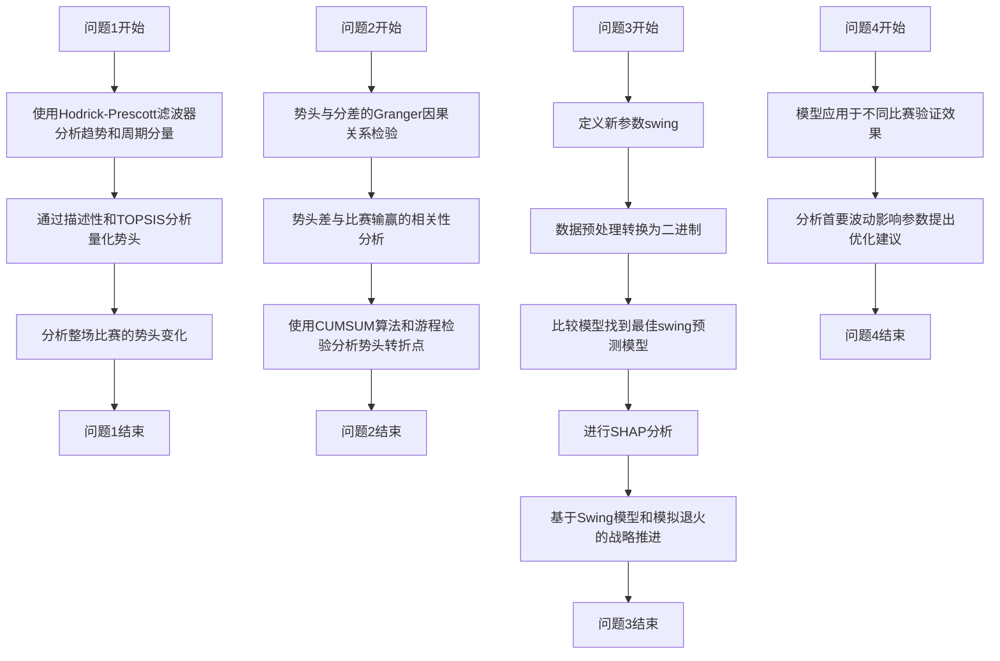
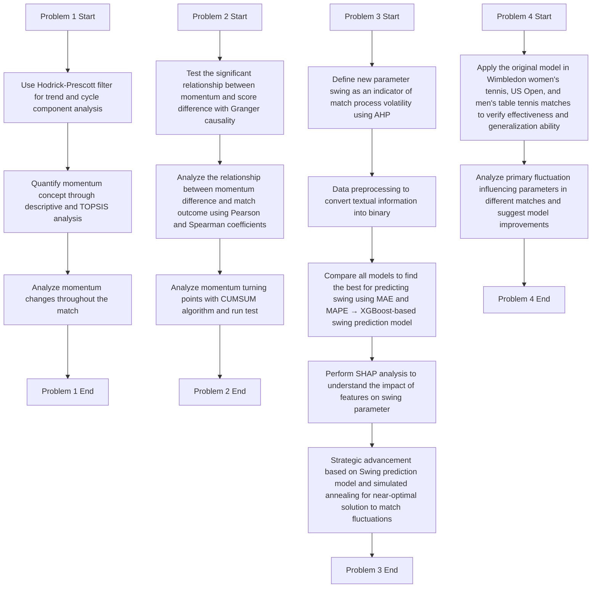

# our work

### Problem1

1. 首先第一题我们分了两个方面来解决，首先是Hodrick-Prescott滤波器，趋势分量和周期分量分离分析得到了基本的比赛局势变化

2. 之后通过主观描述性分析以及客观的Topsis分析法量化了“势头”的概念，得到了基本的评价指标

3. 之后分析了整场比赛的势头变化

### Problem 2

1. 首先通过得分差异与势头的Granger因果关系检验势头与选手分差之间的显著关系
2. 之后检验势头差与比赛选手输赢之间的关系，用皮尔逊以及斯皮尔曼相关系数验证势头差对于预测比赛输赢的准确度
3. 最后用cumsum算法分析势头的转折点，并进行游程检验，来分析势头变化与转折点的显著性是否呈现随机性

### Problem 3

1. 定义新参数swing作为比赛流程波动性的指标（原势头、连胜参数以及运动员体力）
2. 数据预处理，将文本格式信息转换为二进制
3. 对比所有预测swing的模型，比较mae与mape寻找最佳预测模型→基于XGBoost的swing预测模型
4. 进行shap分析，得到各特征对于swing参数的影响相关性
5. 基于Swing预测模型和模拟退火的战略推进，分析对于比赛波动改变策略的近优解

### Problem 4

1. 将原本模型运用在wimbledon女子网球联赛、美国网球锦标赛以及男子乒乓球比赛中，验证模型效果以及泛化能力
2. 分析不同比赛中的首要波动影响参数，提出模型优化建议

